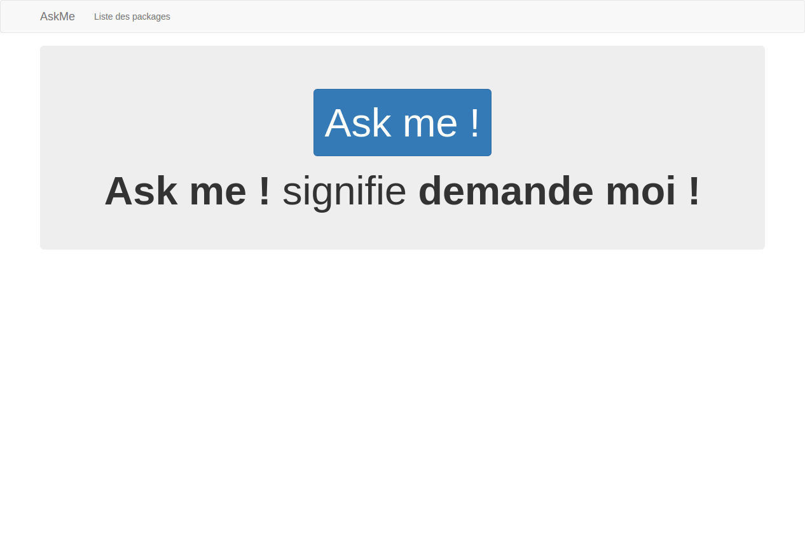

# Ask me !

**Ask me !** signifie **demande moi !**

#### Résumé

Ask-me est un outils qui gère des packages de questions de facon décentraliser.

Il dispose d'un moteur de recherche qui va rechercher sur packagist les dépot avec le tag askme-compose.

Ensuite il télécharge le askme-compose.json de ce dépot qui expose différentes catégorie de question et les fichiers yml associé.

L'outils affiche ensuite la liste de ces catégorie et charge les fichiers à la demande quand une categorie de ce dépot est demandé.

Un systeme de cache permet d'optimiser l'affichage des dépots déjà vu.

#### Fonctionalités

- Questions sous forme de package
- Décentralisation des packages de questions
- Moteur de recherche des packages (requetage sur packagist)
- Moteur optimiser grace au cache implémentée
- Mode hors ligne disponible pour les packages mis en favoris 

#### Prérequis 

- npm
- nodejs v0.12
- http-server
- bower
- Extension chrome pour le cross origin pour les tests sur le pc (https://chrome.google.com/webstore/detail/allow-control-allow-origi/nlfbmbojpeacfghkpbjhddihlkkiljbi)

#### Installation 

  git clone https://github.com/jean-pasqualini/askme-angular-web-platform.git && cd askme-angular-web-platform
  
  sudo add-apt-repository ppa:rwky/nodejs
  
  sudo apt-get update
  
  sudo apt-get install nodejs
  
  Si la commande "node -v" ne marche pas faite "hash -r" puis "node -v" de nouveau
  
  sudo npm install bower -g
  
  bower install
  
  sudo npm install http-server -g
  
  http-server ./www
  
  Installer l'extension 'https://chrome.google.com/webstore/detail/allow-control-allow-origi/nlfbmbojpeacfghkpbjhddihlkkiljbi' sur chrome

#### Création apk et installation sur android avec cordova

... Documentation à venir

#### Examples d'écrans 

